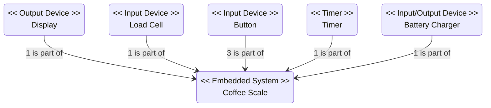
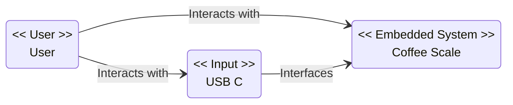
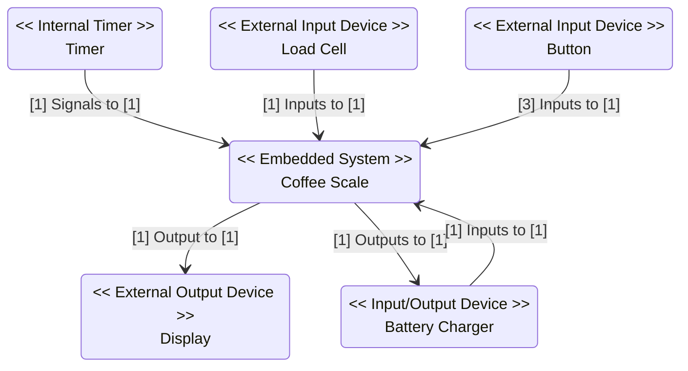

# COMET/RTE

This document is to detail the design of the Coffee Scales using the COMET/RTE (Concurrent Object Modeling and Architectural Design Method for Real-Time Embedded systems) method from Real-Time Software Design for Embedded Systems by Hassan Gomaa.

## Problem Description

The Coffee Scales is a simple, easy to use set of scales aimed at pour over coffee making. Key features are:
- Fast Startup
- Waterproof
- Tactile Buttons
- Open Source Design
- Rechargeable

The scales will have three physical tactile buttons. One to turn the device on and off, one to tare the scale and one to control the stopwatch. A single press of the stopwatch button will start the timer, another press will pause it. A double press will pause the timer and reset it to zero. It will also have a load cell capable of measuring up a mass up to 2kg within 0.1g. The scales will have a display that will show the stopwatch time, weight on the scale and battery life. The display should also be capable of displaying errors or warnings such as if the mass on the scale is too large. The scale will be battery powered and recharged over USB C. 

## Structural Modeling

### Conceptual Structural Model of Problem Domain

### System Context Model

### Software System Context Model 

