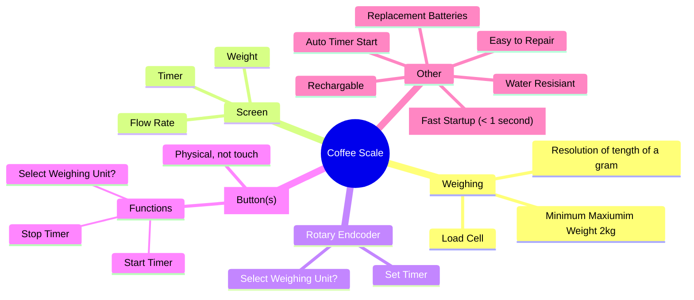
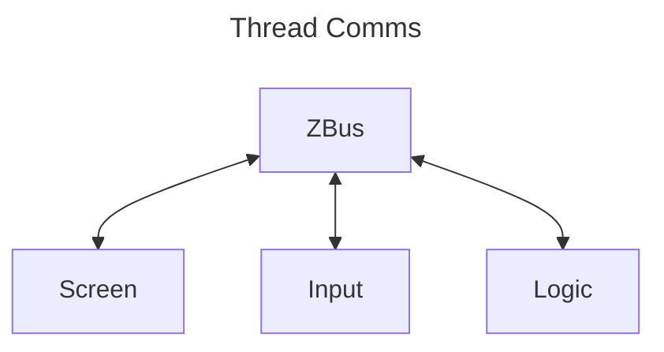
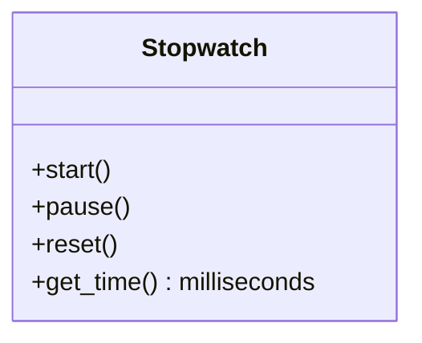

# Design

```mermaid
mindmap
  root((Coffee Scale))
    Weighing
        Resolution of tength of a gram
        Minimum Maxiumim Weight 2kg
        Load Cell
    Screen
        Weight
        Flow Rate
        Timer
    Rotary Endcoder
        Set Timer
        Select Weighing Unit?
    Button["Button(s)"]
        Functions
            Start Timer
            Stop Timer
            Select Weighing Unit?
        Physical, not touch
    Other
        Water Resisiant
        Easy to Repair
        Auto Timer Start
        FS["Fast Startup (< 1 second)"]
        Rechargable
        Replacement Batteries
```

```mermaid
---
title: Thread Comms
---
flowchart TD
    ZBus <--> Screen
    ZBus <--> Input
    ZBus <--> Logic
```

## Stopwatch

```mermaid
classDiagram
    Stopwatch: +start()
    Stopwatch: +pause()
    Stopwatch: +reset()
    Stopwatch: +get_time() milliseconds
```

## Buttons

